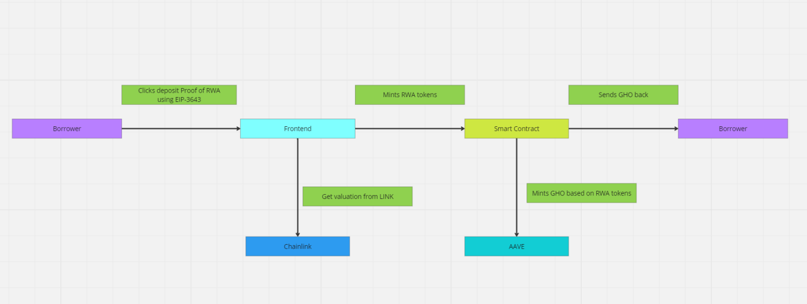

# ETHGlobal_LFGHO_hackathon_2024

## Summary
GHOmium Assets: Earn GHO by depositing Real-World Assets (RWAs) like bonds, Bitcoin ETFs, and gold. Utilize our smart contract facilitator, Chainlink CCIP integration, and health index dashboard. Unique benefits: Collateral earns interest, and AAVE users get stkAAVE discounts.

## Problem & opportunity
In order to increase liquidity for GHO and to allow for more participants to join DeFi and AAVE ecosystem, we believe that an RWA-based Facilitator is needed. According to , the total value of RWA tokenization is expected to increase from $300 billion in 2022 to over $10 trillion by 2023, representing a 30x increase. If GHO is backed by real-world assets whose volatility is less than crypto, then its peg will be stronger.

## Solution
*This is the ideal description of the "desired state" of the product and may not reflect the actual MVP*
We are creating a new Facilitator for GHO based on Real-world Assets. For users who already have the tokens that represent their real-world assets on-chain, they can deposit their tokens into our facilitator and receive a receipt token equivalent to the deposit value. Let's call this token GMA, which stands for GHOmium assets.

In order to generate revenues for the facilitator, our smart contract will deposit into other protocol for low-risk yield, these could range from AAVE lending, liquidity providers, to other premium treasury investment services.

Users want to deposit their RWA tokens into our facilitator because of 2 reasons:
- They can earn interest from holding the GMA token.
- They can mint GHO by borrowing based on amount of RWA collateral that they deposit into our protocol, ideally at about 50% or less the value of what they deposit into the smart contract. They can use this GHO token to pursue other DeFi activities as they see fit.
In addition to these 2 reasons, in real life the real-world assets may still be generating yield, so it's double yield for them.

The default mode is that users can lock their RWA tokens flexibly for some yield. But if they decide to lock their tokens longer, then we will also increase the yield for them since we can use that locked RWA to farm longer-term investments.

### Technology architecture and customer flow

## User Flow
After users have already receive the tokenized forms of their real-world assets, they can go to our protocol and decide whether
1. User connects to the site with their Metamask or WalletConnect
2. User decides whether they want to deposit flexibly or do locked deposit for higher yield.
3. User will receive the respective GMA token (GHOMium Assets) that represent the value of their deposit into our vault. However, this token will increase in value over time the longer they decide to hold the tokens with us. This is because our protocol is actively yield farming in order to get the yield and pay out to users.
4. User can mint GHO token based on the amount of their deposit. Users are free to do what they want with their newly minted GHO token.
5. If they want to withdraw their RWA tokens, they have to pay back GHO and then they can withdraw their token.

## Future Work
Some thoughts for how the whole project can be built out further:
- Integrate the yield-farming capability so that the facilitator can be self-sustaining
- Work with other RWA protocols to be able to bring their products on-chain.
- Integrate with more and more real-world assets through Chainlink CCIP and Chainlink Proof of Reserves so we can show the health of our protocol through a simple and easy-to-understand dashboard.

## Deployed contract (all verified)
### Sepolia Testnet  (chainID: 11155111)
| Contract |                           Contract address |
| :------- | -----------------------------------------: |
| Facilitator  | 0x6E7D16A5B77072A7722E4F6bCcD538C8962864C0 |
Contract link: https://sepolia.etherscan.io/address/0x6e7d16a5b77072a7722e4f6bccd538c8962864c0#code#F15#L1

## Others

### Demo movie

### Demo prototype
https://www.figma.com/proto/fyf2CrNcC0YUXozx8IyLlD/LFGHO-Hackathon%3A-GHOmium?type=design&node-id=144-1982&viewport=-6894%2C9779%2C0.52&t=JGZUYAw6MHKvW5HU-0&scaling=scale-down&starting-point-node-id=155%3A2967

### How to run locally
Users will need to prepare these API keys:
- Backend requires Moralis API key to run
- Frontend requires Alchemy API and WalletConnect API key
- Contract requires Alchemy API key

1. Go to the backend folder and type:
2. npm run start
3. In a separate terminal, go to the frontend folder and type:
4. npm run dev
